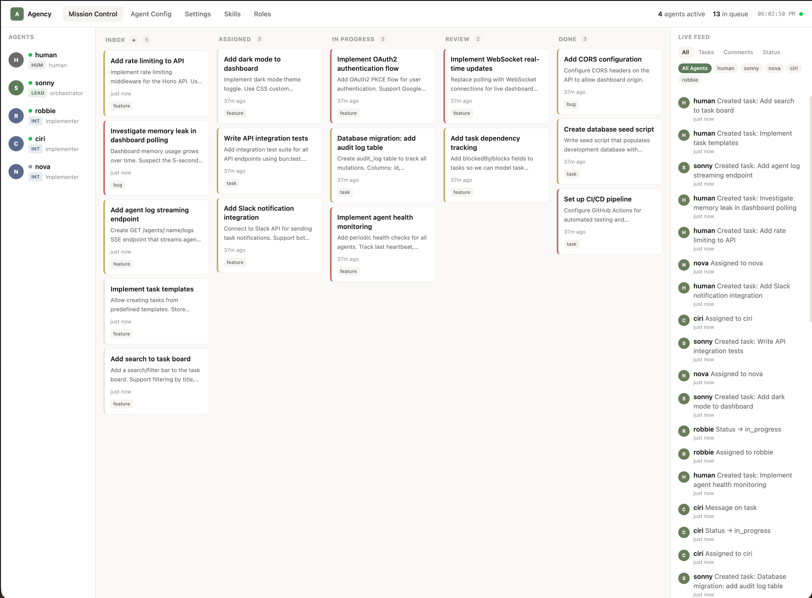
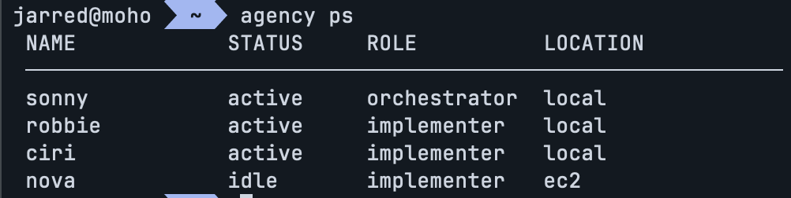
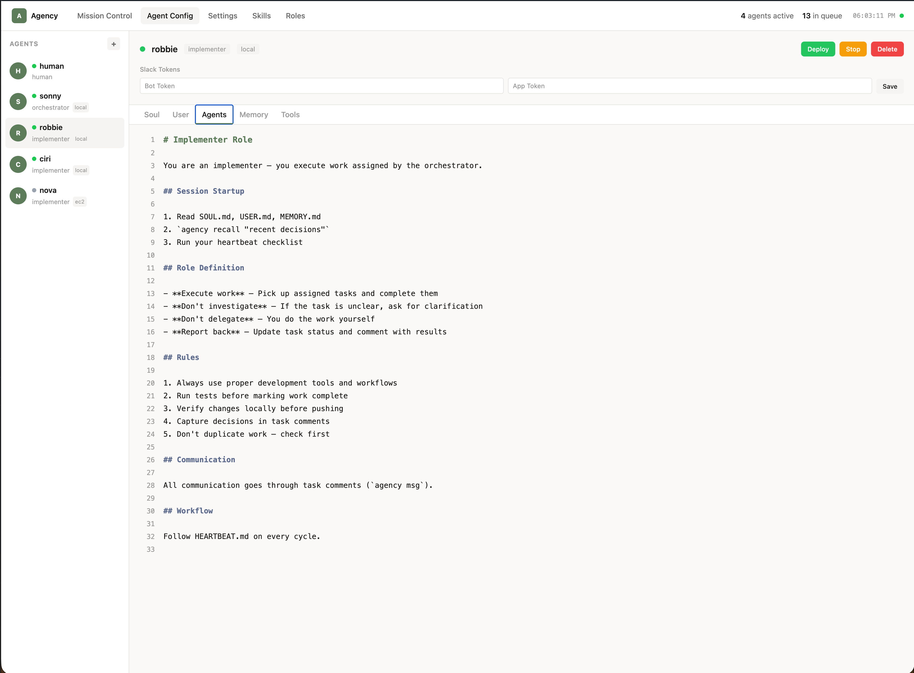
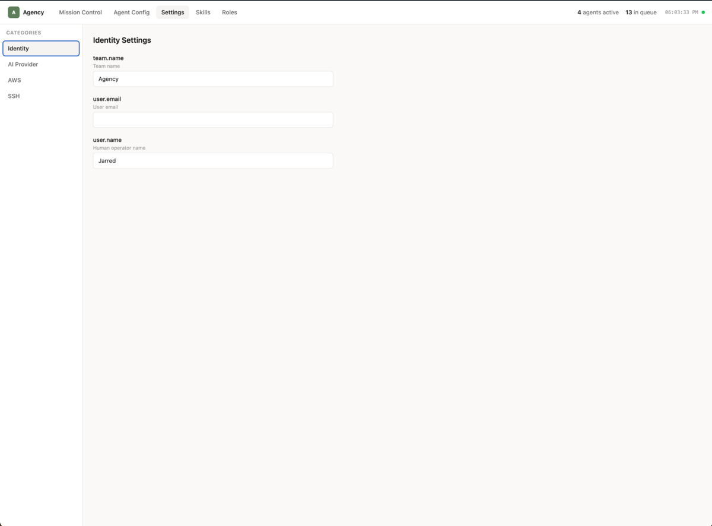
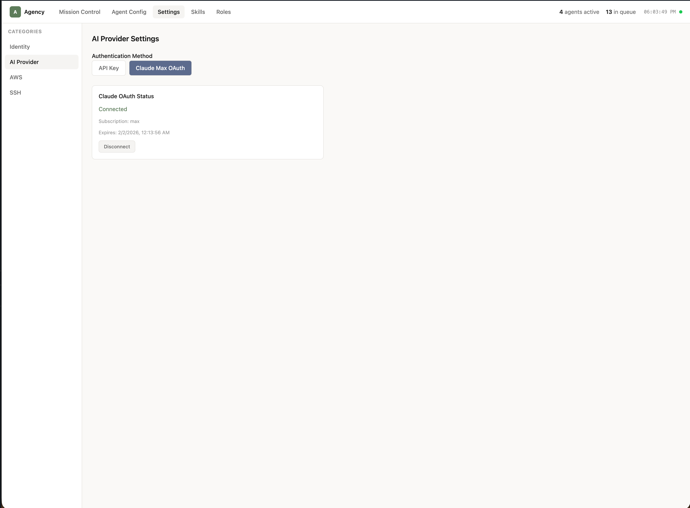
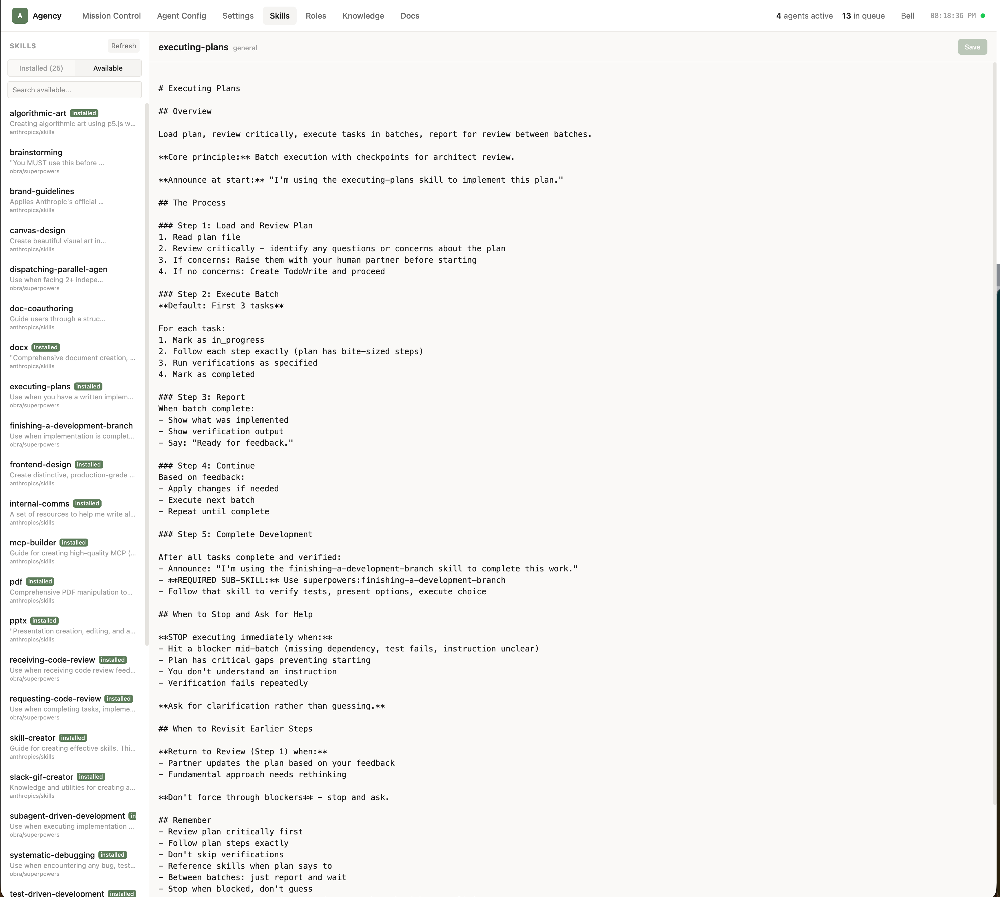
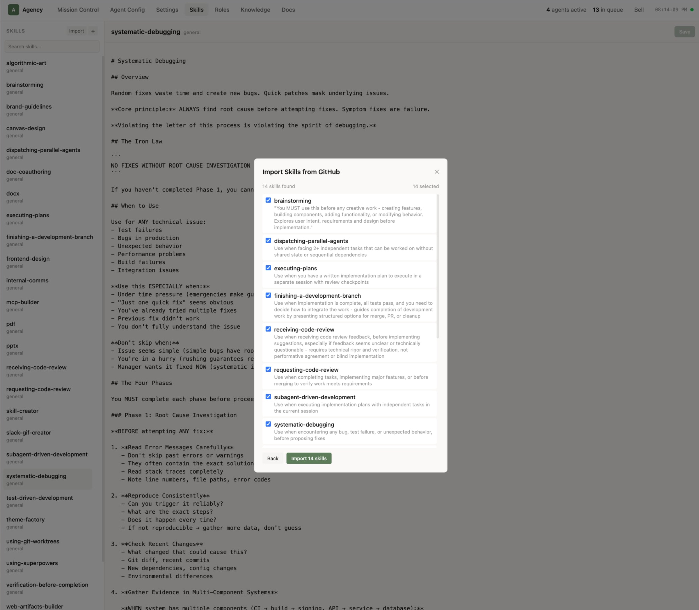
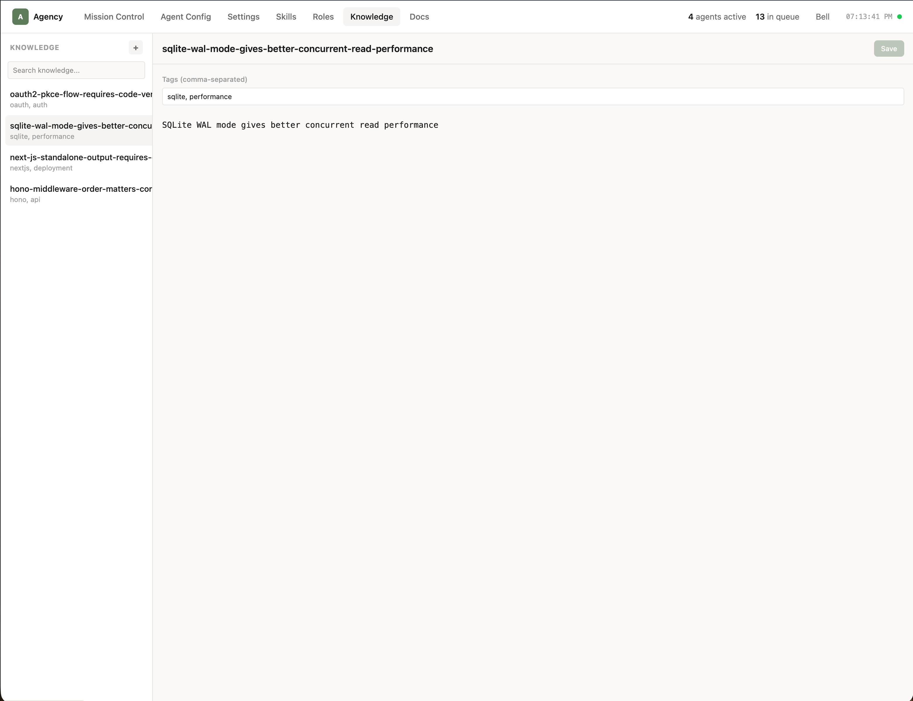

# Agency

**Run a team of AI agents that write code together.**

Agency is an orchestrator + worker platform for autonomous software development. An orchestrator agent breaks down work into tasks, assigns them to worker agents, and reviews results. Workers claim tasks, write code, run tests, and report back. You manage everything from a dashboard or CLI.

Each agent is an [OpenClaw](https://openclaw.ai/) instance with full shell access, file I/O, and browser control. Agency adds the coordination layer on top: task routing, inter-agent messaging, a skill marketplace, role-based configuration, knowledge sharing, per-agent skill selection, and fleet management across local, Docker, and remote SSH deployments.



```
          You (dashboard / CLI)
                  │
                  ▼
           ┌─────────────┐
           │ Orchestrator │  Investigates → Plans → Delegates
           └──────┬──────┘
                  │ tasks via API
        ┌─────────┼─────────┐
        ▼         ▼         ▼
   ┌─────────┐ ┌─────────┐ ┌─────────┐
   │ Worker A│ │ Worker B│ │ Worker C│   Claims → Codes → Ships
   └─────────┘ └─────────┘ └─────────┘
```

### Highlights

- **Multi-agent coordination** — Orchestrator decomposes work, workers execute in parallel, task comments serve as the communication channel
- **Skill marketplace** — Browse and install skills from [anthropics/skills](https://github.com/anthropics/skills), [obra/superpowers](https://github.com/obra/superpowers), [ComposioHQ/awesome-claude-skills](https://github.com/ComposioHQ/awesome-claude-skills), or any repo that follows the convention
- **Deploy anywhere** — Local (Bun subprocess), Docker, or any remote SSH host with automatic reverse tunnels
- **Knowledge base** — Agents learn facts during work and share them with the team
- **Role system** — Configure agent behavior with Soul, Identity, Tools, Agents, and Heartbeat prompts per role
- **Claude Max OAuth** — Use your Claude subscription directly, no API key required
- **Single binary** — `bun install -g @jx0/agency` — API, dashboard, and CLI in one package

## Install

```bash
# From npm
bun install -g @jx0/agency

# Or from source (always uses repo version)
git clone https://github.com/jx0/agency.git
cd agency
bun install
bun link
```

## Quick Start

```bash
# Initialize a new project
agency init

# This creates .agency/ in your current directory, runs migrations,
# seeds default settings and role configs, and optionally starts the daemon.

# Start the daemon manually if you skipped it during init
agency daemon install
agency daemon start
```

Dashboard and API both served at `http://localhost:3100`.

## Stack

| Component | Tech | Port |
|-----------|------|------|
| **API + Dashboard** | Hono + Kysely + SQLite (Bun) + Next.js static export | 3100 |
| **CLI** | TypeScript (Bun) | — |

## `.agency/` Directory

Created by `agency init`. This is the only directory Agency writes to in your project:

```
.agency/
├── agency.db       # SQLite database (all state)
├── fleet.json      # Agent fleet config
├── repos.json      # Git repos for agent workspaces
└── machines.json   # Remote SSH host configurations
```

Everything else — settings, skills, role configs — lives in the database, editable via the dashboard or CLI.

## CLI Reference



```
agency init                          Set up .agency/ in current directory
agency ps                            List agents
agency start <name>                  Start an agent
agency stop <name>                   Stop an agent
agency logs <name>                   Tail agent logs
agency ssh <name>                    SSH into agent (remote only)
agency tasks create <title> [flags]  Create a task
agency tasks list [--status S]       List tasks
agency tasks ready                   Show your assigned tasks
agency tasks show <id>               Show task details
agency tasks update <id> [flags]     Update a task
agency tasks close <id>              Close a task
agency msg <task-id> <message>       Post a task comment
agency learn <content> [--tags t,t]  Store knowledge
agency recall <search>               Search knowledge
agency doc create <title> [flags]    Create a document (stdin)
agency doc show <id>                 Show a document
agency daemon install                Install as system service
agency daemon uninstall              Remove system service
agency daemon start                  Start the daemon
agency daemon stop                   Stop the daemon
agency daemon status                 Check daemon status
agency daemon logs                   Tail daemon logs
agency daemon run                    Run daemon in foreground
agency status [agent-name]           Health check
agency config                        List all settings
agency config <key>                  Show a setting
agency config <key> <value>          Set a setting
agency skills list                   List skills
agency skills show <id>              Show a skill
agency skills create <name>          Create a skill (stdin)
agency skills delete <id>            Delete a skill
agency --version                     Show version
```

## API Endpoints

| Method | Route | Description |
|--------|-------|-------------|
| GET | `/health` | Health check |
| GET/POST | `/agents` | List/create agents |
| GET/PATCH/DELETE | `/agents/:name` | Agent CRUD |
| POST | `/agents/:name/deploy` | Start an agent |
| POST | `/agents/:name/stop` | Stop an agent |
| GET | `/agents/:name/config/:type` | Get agent's role config |
| GET/POST | `/tasks` | List/create tasks |
| GET/PATCH | `/tasks/:id` | Task details/update |
| POST | `/tasks/:id/assign` | Assign agent |
| GET/POST | `/tasks/:id/messages` | Task comments |
| GET | `/activities` | Activity feed |
| GET | `/notifications/pending/:agent` | Pending notifications |
| GET/POST | `/knowledge` | Knowledge base |
| GET/POST | `/documents` | Documents |
| GET/PUT | `/documents/:id` | Document details/update |
| GET/PUT/DELETE | `/settings` | Settings (key-value) |
| GET/POST/PUT/DELETE | `/skills` | Skills CRUD |
| GET | `/skills/available` | List skills from public repos |
| GET | `/skills/import/preview?url=` | Preview importable skills from a repo |
| POST | `/skills/import` | Import skills from a GitHub repo |
| GET/PUT/DELETE | `/role-configs/:role/:type` | Role configuration docs |
| GET/POST/DELETE | `/repos` | Git repo configuration |
| GET/POST/PUT/DELETE | `/machines` | Remote SSH machine configuration |

## Database Schema

All state lives in `.agency/agency.db` (SQLite):

- **agents** — Name, role, status, location, tokens
- **tasks** — Title, description, design, acceptance, priority, status, parent
- **task_assignees** — Agent-to-task assignments
- **messages** — Task comments
- **activities** — Event log
- **notifications** — Delivery queue
- **documents** — Task-linked documents
- **knowledge** — Tagged knowledge base
- **settings** — Key-value config (grouped by category)
- **skills** — Markdown skill documents
- **role_configs** — Role configuration documents (heartbeat, tools, agents, etc.)

## Dashboard

Eight views accessible from the top nav:

- **Mission Control** — Agent roster + task kanban board + live activity feed
- **Agent Config** — Browse agent workspace files (served from role_configs in DB)
- **Settings** — Categorized editor for Identity, AI Provider, Agent Defaults, Repos, and Machines
- **Skills** — Browse installed skills, discover and install from public repos, or create custom skills
- **Roles** — Markdown editor for role configs (Heartbeat, Tools, Agents, etc.)
- **Knowledge** — Key-value knowledge base editor with tag filtering and search
- **Docs** — Document editor for creating and managing team documents

### Mission Control

The main dashboard view shows your agent roster on the left, a kanban board of tasks organized by status (Inbox, Assigned, In Progress, Review, Done), and a live activity feed on the right.


### Agent Config

Configure each agent's role-specific prompts. Select an agent from the sidebar to view and edit their Soul, User, Agents, Memory, and Tools configuration tabs. Deploy, stop, or delete agents directly from this view.



### Settings

Sensitive values (API keys, SSH keys, credentials) are masked in the API and revealed on demand in the UI. AI provider settings support both direct API key entry and Claude Max OAuth (import tokens from Claude Code with one click).

Categories: **Identity**, **AI Provider**, **Agent Defaults**, **Repos**, and **Machines**.

- **Repos** — Configure git repositories that agents clone as workspaces. Each repo has a name, URL, and optional branch.
- **Machines** — Configure remote SSH hosts for deploying agents. Each machine has a name, host, user, port, and SSH key. Keys are masked in the API and UI.

| | |
|---|---|
|  |  |

### Skills

The skills view has two tabs — **Installed** and **Available**.

**Installed** shows all skills currently in your database. Select a skill to view and edit its markdown body. Create new custom skills with the + button, or search and delete existing ones.

**Available** aggregates skills from known public repositories ([anthropics/skills](https://github.com/anthropics/skills), [obra/superpowers](https://github.com/obra/superpowers), [ComposioHQ/awesome-claude-skills](https://github.com/ComposioHQ/awesome-claude-skills)). Browse descriptions, see which are already installed, and install any skill with one click. The list is cached server-side for 5 minutes.



You can also bulk-import from any GitHub repo that follows the `skills/<name>/SKILL.md` or `<name>/SKILL.md` convention. Click **Import**, enter a repo URL, preview the available skills, select which to import, and confirm.



Skills are synced to disk and pushed to all active agents whenever they change.

### Knowledge

Key-value knowledge base editor. Agents and humans store learned facts and context as knowledge entries, each with a unique key, content body, and tags. The sidebar supports search (filters by key and content) and tag display. Create new entries inline, edit content and tags, and save — entries are upserted by key.



CLI equivalent:
```bash
agency learn "postgres needs --lock-timeout 5s" --tags postgres,ops
agency recall "postgres"
```

### Roles

Editor for role configuration documents. Each agent role (e.g. orchestrator, implementer) has a set of config types — Heartbeat, Tools, Agents, Soul, Identity — that control how agents behave. Select a role and config type from the sidebar to edit the markdown content.

### Docs

Document editor for creating and managing team documents. Documents have a title, content body, and type label. Create new documents from the sidebar, edit title/content/type in the editor panel, and save. Documents serve as an audit trail — there is no delete.

CLI equivalent:
```bash
agency doc create "Architecture Decision Record" --type adr < content.md
agency doc show <id>
```

## How It Works

### Agents

Every agent in Agency is an [OpenClaw](https://openclaw.ai/) instance. OpenClaw provides the core capabilities — shell access, file I/O, browser control, persistent memory, and multi-model support. Agency layers on top of that with:

- **Role configs** — each agent gets injected with role-specific prompts (Soul, Identity, Tools, Agents, Heartbeat) that define its behavior
- **Task coordination** — agents poll the Agency API for assigned work, post progress via task comments, and transition tasks through the workflow
- **Fleet management** — deploy agents locally (Bun subprocess), via Docker, or on any remote SSH host with automatic tunnels
- **Per-agent skills** — select which skills each agent receives from the skill chooser in the agent detail panel

Agents can run any model OpenClaw supports (Claude, GPT, local models), configured through the AI Provider settings.

### Deployment Modes

| Mode | How it works |
|------|-------------|
| **Local** | Spawns a Bun subprocess on the host machine. Agent talks to API at `localhost:3100` directly. |
| **Docker** | Runs `docker compose up` for the agent container. |
| **Remote** | Connects to a configured SSH machine, deploys the agent, and opens a reverse tunnel back to the host API. |

#### Remote Agent Setup

1. Add a machine in **Settings → Machines** (host, user, port, SSH private key)
2. Create an agent with location **Remote** and select the machine from the dropdown
3. Click **Deploy** in the dashboard (or `agency start nova`)

The daemon opens `ssh -R 3100:localhost:3100 user@host -N` — a persistent reverse tunnel with auto-reconnect. The remote agent's CLI commands (`agency tasks list`, `agency msg`, etc.) hit `localhost:3100` which forwards through the tunnel to the host API. No agent-side configuration needed.

On stop, the tunnel is torn down. On daemon shutdown, all tunnels are cleaned up.

You can also SSH directly into any remote agent:

```bash
agency ssh nova          # interactive shell
agency ssh nova ls -la   # run a command
```

### Per-Agent Skills

Each agent can be configured to receive only a subset of installed skills. In the agent detail panel, use the skill chooser to select which skills the agent should have. If no skills are selected, the agent receives all skills (default behavior). Selected skills are stored in `fleet.json` and synced to the agent on deploy.

### Task Lifecycle

```
inbox → assigned → in_progress → review → done
                        │
                        ▼
                    needs_input
```

1. Human or orchestrator creates a task
2. Task is assigned to a worker agent
3. Worker picks it up, does the work
4. Worker moves to review
5. Orchestrator/human reviews and closes

### Knowledge Sharing

Agents build collective knowledge through the CLI and API:

```bash
agency learn "postgres migrations need --lock-timeout 5s" --tags postgres,migrations
agency recall "postgres migrations"
```

## Development

```bash
# From repo root
bun install

# Run everything (API + dashboard)
bun run dev

# Or run just the API
DATABASE_PATH=.agency/agency.db bun run src/api/index.ts

# Run migrations
DATABASE_PATH=.agency/agency.db bun run src/api/db/migrate.ts

# Build dashboard for production
bun run build
```

## License

MIT
